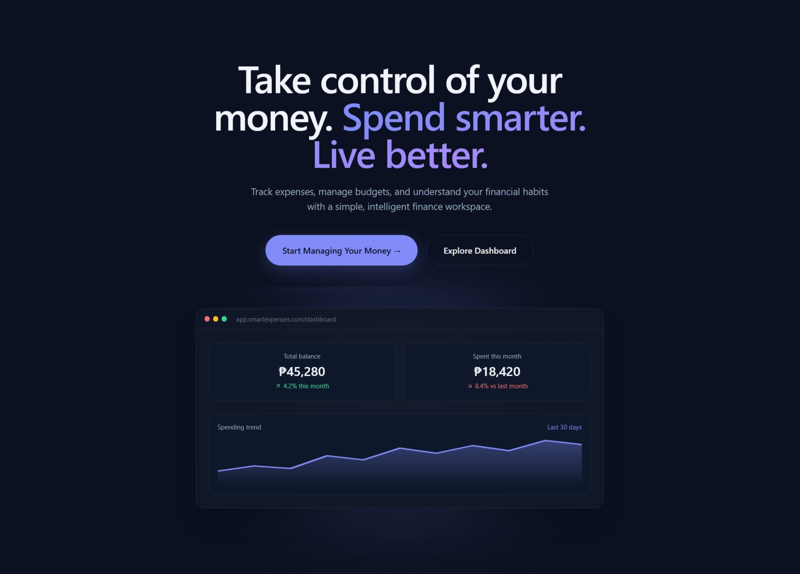

# Smart Expenses Manager

> A modern personal finance application designed to help users track expenses, manage budgets, understand spending patterns, and make better financial decisions.



---

## 📌 Project Status

> **Current Project Phase: Phase 2 — Core Expense Tracking**

Smart Expenses Manager has completed its initial foundation, including the landing page, authentication system, database setup, protected routes, and the main application layout.

Development is currently focused on building the core expense management features that will allow users to record transactions, manage income and expenses, organize spending by category, and monitor their financial activity.

---

# 🎯 Project Goal & Vision

Most expense trackers simply answer:

> **"How much did I spend?"**

Smart Expenses Manager aims to go further.

The application is designed to help users understand their financial behavior and answer questions such as:

- Where is my money really going?
- Am I staying within my budget?
- Which categories are taking most of my income?
- How has my spending changed over time?
- What spending habits should I improve?
- How close am I to my financial goals?

The long-term goal is to build a personal finance platform that combines:

- Simple expense tracking
- Income management
- Budget planning
- Financial analytics
- Spending visualizations
- Personalized financial insights
- Smart categorization
- Future AI-powered recommendations

The project is being developed with **React + TypeScript**, with a focus on maintainability, usability, responsive design, and a clean financial dashboard experience.

---

# 🚀 Project Roadmap

## Phase 1 — Foundation & Authentication

**Status: ✅ Completed**

The first phase focused on establishing the technical foundation of the application.

### Completed

- ✅ Vite + React + TypeScript project setup
- ✅ React Router v7 routing
- ✅ Landing page implementation
- ✅ Responsive navigation bar
- ✅ Hero section
- ✅ Features section
- ✅ Smart Insights section
- ✅ How It Works section
- ✅ Final Call-to-Action section
- ✅ Footer
- ✅ Login page
- ✅ Signup page
- ✅ Supabase authentication
- ✅ JWT-based authentication
- ✅ AuthContext
- ✅ Protected routes
- ✅ Automatic session handling
- ✅ PostgreSQL database
- ✅ Row Level Security (RLS)
- ✅ User-specific data isolation
- ✅ Automatic default category creation
- ✅ Dashboard layout foundation
- ✅ Transactions page foundation
- ✅ Income page foundation
- ✅ Budgets page foundation
- ✅ Account page foundation
- ✅ Settings page foundation
- ✅ Scroll-to-top component
- ✅ Centralized theme system
- ✅ Responsive layout structure
- ✅ Tailwind CSS configuration
- ✅ Framer Motion animations
- ✅ shadcn/ui infrastructure
- ✅ Lucide icons

---

# Phase 2 — Core Expense Tracking

**Status: 🔄 In Progress**

The current development phase focuses on making the application functional as a personal expense tracker.

### Currently Developing

- 🔄 Expense data models
- 🔄 Expense creation
- 🔄 Expense editing
- 🔄 Expense deletion
- 🔄 Expense categorization
- 🔄 Transaction listing
- 🔄 Income entry
- 🔄 Balance calculation
- 🔄 Dashboard financial summaries
- 🔄 Responsive expense management
- 🔄 Supabase CRUD operations

### Planned for Phase 2

- 📋 Search transactions
- 📋 Filter transactions by category
- 📋 Filter transactions by date
- 📋 Sort transactions
- 📋 Transaction details
- 📋 Expense validation
- 📋 Income validation
- 📋 Empty states
- 📋 Loading states
- 📋 Error handling improvements

---

# Phase 3 — Analytics & Budget Management

**Status: 📋 Planned**

Once the core transaction system is stable, the next phase will focus on helping users understand their financial activity.

### Planned Features

- 📋 Interactive spending charts
- 📋 Monthly spending summaries
- 📋 Category-based analytics
- 📋 Spending trends
- 📋 Income vs. expense comparison
- 📋 Monthly budgets
- 📋 Category budgets
- 📋 Budget progress indicators
- 📋 Budget alerts
- 📋 Overspending notifications
- 📋 Financial summary cards
- 📋 Monthly financial reports
- 📋 Recharts integration
- 📋 CSV export
- 📋 PDF reports

---

# Phase 4 — Smart Financial Features

**Status: 📋 Planned**

This phase will introduce intelligent features that go beyond traditional expense tracking.

### Planned Features

- 📋 Smart spending insights
- 📋 Spending pattern detection
- 📋 Personalized budget recommendations
- 📋 AI-powered expense categorization
- 📋 Unusual spending detection
- 📋 Monthly financial summaries
- 📋 Personalized saving suggestions
- 📋 Financial goal tracking
- 📋 Smart notifications
- 📋 Spending habit recommendations

---

# Phase 5 — Advanced & Cloud Features

**Status: 📋 Planned**

The final planned phase will focus on expanding the application and improving its long-term usability.

### Planned Features

- 📋 Receipt image upload
- 📋 OCR-based receipt parsing
- 📋 Automatic transaction extraction
- 📋 Multi-currency support
- 📋 Cloud synchronization
- 📋 Data backup
- 📋 Data import
- 📋 Advanced account management
- 📋 Mobile application
- 📋 Progressive Web App support
- 📋 Dark/Light theme switching
- 📋 Advanced notification system

---

# 🛠️ Tech Stack

| Area | Technology | Status | Purpose |
|---|---|---|---|
| Frontend | React 19 | ✅ | User interface |
| Language | TypeScript ~5.9 | ✅ | Type safety and maintainability |
| Styling | Tailwind CSS 4.2 | ✅ | Responsive styling |
| UI Components | shadcn/ui | ✅ | Reusable UI components |
| Animations | Framer Motion 12 | ✅ | UI animations and transitions |
| Icons | Lucide React 0.576 | ✅ | Interface icons |
| Routing | React Router v7 | ✅ | Client-side routing |
| Build Tool | Vite 7.3 | ✅ | Development and production builds |
| Linting | ESLint 9 | ✅ | Code quality |
| Authentication | Supabase Auth | ✅ | User authentication |
| Backend | Supabase | ✅ | Backend services |
| Database | PostgreSQL | ✅ | Application data storage |
| Database Security | Supabase RLS | ✅ | User data isolation |
| Database SDK | @supabase/supabase-js | ✅ | Supabase integration |
| State Management | Zustand | 📋 Planned | Global application state |
| Charts | Recharts | 📋 Planned | Financial data visualization |
| Forms | React Hook Form | 📋 Planned | Form management |
| Validation | Zod | 📋 Planned | Schema validation |

---

# 🔐 Authentication System

Smart Expenses Manager uses **Supabase Authentication** with JWT-based sessions.

Supabase handles authentication, session management, token refresh, and user identity.

## Authentication Features

### Global Authentication State

The application uses an `AuthContext` to make authentication information available throughout the application.

Located at:

```text
src/contexts/AuthContext.tsx
````

The context provides:

```typescript
interface AuthContextType {
  user: User | null;
  session: Session | null;
  isLoading: boolean;
  signIn: (email: string, password: string) => Promise<void>;
  signUp: (
    email: string,
    password: string,
    fullName: string
  ) => Promise<void>;
  signOut: () => Promise<void>;
}
```

### Protected Routes

Authenticated pages are protected using:

```text
src/components/ProtectedRoute.tsx
```

Users who are not authenticated are redirected to the login page.

### Session Management

Supabase automatically manages:

* JWT sessions
* Session persistence
* Token refresh
* Authentication state changes
* Logout handling

### User Data Isolation

The PostgreSQL database uses **Row Level Security (RLS)** to ensure users can only access their own financial data.

---

# 🗄️ Database

The application uses:

* **Supabase**
* **PostgreSQL**
* **Row Level Security (RLS)**

The database schema is located at:

```text
supabase-schema.sql
```

The database is designed around user-specific financial information.

Expected core entities include:

```text
Users
 ├── Expenses
 ├── Income
 ├── Categories
 ├── Budgets
 └── Financial Goals
```

Each user's financial records are isolated through Supabase RLS policies.

---

# 🎨 Design System

Smart Expenses Manager uses a dark, ocean-inspired financial interface.

The design focuses on:

* Clean layouts
* Subtle borders
* Soft gradients
* Minimal visual noise
* Strong typography
* Financial data readability
* Responsive layouts
* Smooth interactions

The landing page uses a modern ledger-inspired aesthetic rather than a traditional finance dashboard.

---

## 🎨 Theme Colors

| Purpose      | Hex       | Description                         |
| ------------ | --------- | ----------------------------------- |
| Background   | `#091114` | Main application background         |
| Primary Text | `#ECF1F3` | Main readable text                  |
| Primary      | `#98C9DE` | Main actions and buttons            |
| Secondary    | `#1A6382` | Secondary UI elements               |
| Accent       | `#22ADE7` | Interactive elements and highlights |

The application also uses centralized theme tokens through:

```text
src/lib/theme.ts
```

Example:

```typescript
export const colors = {
  bg: "#0B1120",
  bgElevated: "#0F172A",
  primary: "#818CF8",
  secondary: "#A78BFA",
};
```

Keeping the theme centralized makes it easier to update the visual identity of the application without changing every component individually.

---

# 🖥️ Landing Page

The landing page introduces the application and communicates its main purpose before users enter the dashboard.

## Main Sections

### Hero

The Hero section introduces Smart Expenses Manager with a financial ledger-inspired interface and transaction preview.

```text
src/components/Hero.tsx
```

### Features

Highlights the main capabilities of the application.

```text
src/components/FeaturesSection.tsx
```

### Smart Insights

Demonstrates the future direction of the application's financial intelligence features.

```text
src/components/SmartInsights.tsx
```

Example insight:

> Your spending increased 8.4% this month.

The section demonstrates how the application could eventually identify spending patterns and provide actionable recommendations.

### How It Works

Explains the basic user journey:

```text
Track → Understand → Improve
```

```text
src/components/HowItWorks.tsx
```

### Final CTA

Encourages users to create an account and begin managing their finances.

```text
src/components/FinalCTA.tsx
```

### Footer

Contains application information and navigation links.

```text
src/components/Footer.tsx
```

---

# 📱 Authentication Pages

## Login

Located at:

```text
src/pages/Login.tsx
```

Features:

* Email login
* Password authentication
* Input validation
* Loading state
* Error handling
* Supabase authentication
* Automatic dashboard redirect
* Signup navigation
* Password reset entry point

---

## Signup

Located at:

```text
src/pages/Signup.tsx
```

Features:

* Full name registration
* Email registration
* Password creation
* Password confirmation
* Password visibility toggle
* Form validation
* Error handling
* Success feedback
* Email verification support
* Login navigation

---

# 📊 Application Pages

The application currently contains the following core pages:

| Page         | Purpose                            | Status |
| ------------ | ---------------------------------- | ------ |
| Landing Page | Public application introduction    | ✅      |
| Login        | User authentication                | ✅      |
| Signup       | User registration                  | ✅      |
| Dashboard    | Financial overview                 | 🔄     |
| Transactions | Expense and transaction management | 🔄     |
| Income       | Income tracking                    | 🔄     |
| Budgets      | Budget management                  | 📋     |
| Account      | User profile                       | 🔄     |
| Settings     | Application preferences            | 🔄     |

---

# 🔄 Application Flow

The intended user flow is:

```text
Landing Page
      │
      ▼
   Sign Up
      │
      ▼
Email Verification
      │
      ▼
    Login
      │
      ▼
   Dashboard
      │
      ├── Transactions
      │
      ├── Income
      │
      ├── Budgets
      │
      ├── Account
      │
      └── Settings
```

---

# 📁 Project Structure

```text
Smart Expense Manager/
│
├── components.json
├── eslint.config.js
├── index.html
├── package.json
├── package-lock.json
├── postcss.config.js
├── tailwind.config.js
├── tsconfig.json
├── tsconfig.app.json
├── tsconfig.node.json
├── vite.config.ts
├── README.md
├── .env.local
├── .gitignore
├── supabase-schema.sql
│
├── public/
│   └── vite.svg
│
└── src/
    │
    ├── App.tsx
    ├── index.css
    └── main.tsx
    │
    ├── assets/
    │   └── ...
    │
    ├── components/
    │   ├── Navbar.tsx
    │   ├── Hero.tsx
    │   ├── FeaturesSection.tsx
    │   ├── SmartInsights.tsx
    │   ├── HowItWorks.tsx
    │   ├── FinalCTA.tsx
    │   ├── Footer.tsx
    │   ├── DashboardPreview.tsx
    │   ├── ProtectedRoute.tsx
    │   └── ScrollToTop.tsx
    │
    ├── contexts/
    │   └── AuthContext.tsx
    │
    ├── lib/
    │   ├── theme.ts
    │   ├── utils.ts
    │   └── supabase.ts
    │
    ├── services/
    │   ├── auth.ts
    │   └── expenses.ts
    │
    └── pages/
        ├── LandingPage.tsx
        ├── Login.tsx
        ├── Signup.tsx
        ├── Dashboard.tsx
        ├── Transactions.tsx
        ├── Income.tsx
        ├── Budgets.tsx
        ├── Account.tsx
        └── Settings.tsx
```

---

# ⚙️ Getting Started

## Prerequisites

Make sure the following are installed:

* Node.js 18 or higher
* npm, pnpm, or yarn
* A Supabase account

---

## 1. Clone the Repository

```bash
git clone https://github.com/yourusername/smart-expenses-manager.git
cd smart-expenses-manager
```

---

## 2. Install Dependencies

Using npm:

```bash
npm install
```

Or using pnpm:

```bash
pnpm install
```

Or using yarn:

```bash
yarn install
```

---

# 3. Configure Supabase

Create a project using Supabase.

You will need:

* Supabase Project URL
* Supabase Anon/Public Key

Create a `.env.local` file in the project root:

```env
VITE_SUPABASE_URL="https://your-project-ref.supabase.co"
VITE_SUPABASE_ANON_KEY="your-anon-key-here"
```

---

# 4. Configure the Database

Open the Supabase SQL Editor and run:

```text
supabase-schema.sql
```

This creates the required PostgreSQL tables, relationships, policies, and user-specific data protection.

---

# 5. Configure Authentication

In Supabase, configure the authentication settings according to your development environment.

For local development, your application will normally run at:

```text
http://localhost:5173
```

Make sure the appropriate URL is configured in the Supabase authentication settings.

---

# 6. Start the Development Server

```bash
npm run dev
```

The application should then be available at:

```text
http://localhost:5173
```

---

# 🧪 Development Commands

## Start Development Server

```bash
npm run dev
```

## Build for Production

```bash
npm run build
```

## Preview Production Build

```bash
npm run preview
```

## Run ESLint

```bash
npm run lint
```

---

# 🔒 Environment Variables

Never commit your environment variables or secrets to GitHub.

The `.env.local` file should remain local:

```text
.env.local
```

Example:

```env
VITE_SUPABASE_URL="your-supabase-url"
VITE_SUPABASE_ANON_KEY="your-supabase-anon-key"
```

Make sure `.env.local` is included in `.gitignore`.

---

# 🧩 Core Components

## AuthContext

Handles global authentication state.

```text
src/contexts/AuthContext.tsx
```

Responsibilities:

* Track the current user
* Track the current session
* Sign in
* Sign up
* Sign out
* Monitor authentication state
* Handle loading states

---

## ProtectedRoute

Controls access to authenticated pages.

```text
src/components/ProtectedRoute.tsx
```

Users who are not logged in cannot access protected application pages.

---

## ScrollToTop

Provides a floating scroll-to-top control.

```text
src/components/ScrollToTop.tsx
```

Features:

* Appears after scrolling
* Smooth scrolling
* Framer Motion animations
* Responsive positioning
* Accessible button label

---

# 📈 Planned Dashboard

The dashboard will eventually provide a quick overview of the user's financial situation.

Planned dashboard information includes:

```text
┌─────────────────────────────────────┐
│ Total Balance                       │
├──────────────────┬──────────────────┤
│ Total Income     │ Total Expenses   │
├──────────────────┴──────────────────┤
│ Spending Overview                   │
├─────────────────────────────────────┤
│ Recent Transactions                 │
├─────────────────────────────────────┤
│ Budget Progress                     │
└─────────────────────────────────────┘
```

Future versions will add interactive charts and smart financial insights.

---

# 💰 Expense Management

The core expense system will support:

### Expense Fields

Planned fields include:

```text
Expense
├── ID
├── User ID
├── Amount
├── Category
├── Description
├── Date
├── Payment Method
├── Notes
└── Created At
```

Users will eventually be able to:

* Add expenses
* Edit expenses
* Delete expenses
* Categorize expenses
* Search expenses
* Filter expenses
* Sort expenses
* View transaction details

---

# 💵 Income Management

Income tracking will allow users to record money received from different sources.

Potential income categories include:

* Salary
* Freelance
* Business
* Allowance
* Investment
* Other

Income data will be used to calculate:

```text
Balance = Total Income - Total Expenses
```

---

# 📊 Budget Management

The budget system will allow users to set spending limits.

Example:

```text
Food & Dining
Budget: ₱5,000

Spent: ₱3,750

Remaining: ₱1,250
```

Future budget features will include:

* Monthly budgets
* Category budgets
* Progress indicators
* Budget alerts
* Overspending warnings
* Spending recommendations

---

# 🤖 Smart Insights

One of the long-term goals of Smart Expenses Manager is to provide meaningful financial insights rather than simply displaying numbers.

Example:

> **Spending increased 8.4% this month.**

> The biggest increase came from **Food & Dining**.

> Consider setting a **₱5,000 monthly dining budget**.

Future versions may analyze:

* Spending trends
* Category changes
* Recurring expenses
* Budget performance
* Unusual transactions
* Monthly spending behavior

---

# ♿ Accessibility

The application aims to maintain accessible and user-friendly interfaces.

Current accessibility considerations include:

* Semantic HTML
* Accessible buttons
* Form labels
* ARIA labels where necessary
* Keyboard-friendly controls
* Clear error messages
* Visible focus states
* Readable color contrast
* Responsive layouts

---

# 📱 Responsive Design

Smart Expenses Manager is designed to work across:

* Desktop
* Laptop
* Tablet
* Mobile devices

Responsive behavior is implemented using Tailwind CSS breakpoints and responsive component layouts.

---

# 🔮 Future Improvements

Potential future improvements include:

* 📋 Advanced financial reports
* 📋 Recurring transactions
* 📋 Subscription tracking
* 📋 Savings goals
* 📋 Financial goal tracking
* 📋 Receipt scanning
* 📋 OCR transaction extraction
* 📋 AI-powered categorization
* 📋 AI spending recommendations
* 📋 Multi-currency support
* 📋 Data import/export
* 📋 PDF reports
* 📋 Mobile application
* 📋 PWA support
* 📋 Offline support
* 📋 Cloud synchronization

---

# 🎯 Current Development Priorities

The immediate development priorities are:

1. **Implement expense data models**
2. **Connect expense operations to Supabase**
3. **Build expense CRUD functionality**
4. **Implement transaction categories**
5. **Implement income tracking**
6. **Connect financial data to the dashboard**
7. **Add transaction filtering and searching**
8. **Improve loading and error states**
9. **Add initial financial summaries**
10. **Prepare the application for analytics features**

---

# 🗺️ Development Roadmap

```text
                    SMART EXPENSES MANAGER
                             │
                             ▼
              ┌──────────────────────────┐
              │ Phase 1                  │
              │ Foundation & Auth        │
              │          ✅              │
              └────────────┬─────────────┘
                           │
                           ▼
              ┌──────────────────────────┐
              │ Phase 2                  │
              │ Core Expense Tracking    │
              │          🔄              │
              └────────────┬─────────────┘
                           │
                           ▼
              ┌──────────────────────────┐
              │ Phase 3                  │
              │ Analytics & Budgets      │
              │          📋              │
              └────────────┬─────────────┘
                           │
                           ▼
              ┌──────────────────────────┐
              │ Phase 4                  │
              │ Smart Financial Features │
              │          📋              │
              └────────────┬─────────────┘
                           │
                           ▼
              ┌──────────────────────────┐
              │ Phase 5                  │
              │ Advanced & Cloud         │
              │          📋              │
              └──────────────────────────┘
```

---

# 📌 Current Status Summary

| Area                 | Status         |
| -------------------- | -------------- |
| Project Setup        | ✅ Complete     |
| Landing Page         | ✅ Complete     |
| Authentication       | ✅ Complete     |
| Supabase Integration | ✅ Complete     |
| PostgreSQL Database  | ✅ Complete     |
| Row Level Security   | ✅ Complete     |
| Protected Routes     | ✅ Complete     |
| Dashboard Layout     | 🔄 In Progress |
| Expense CRUD         | 🔄 In Progress |
| Income Tracking      | 🔄 In Progress |
| Categories           | 🔄 In Progress |
| Budget Management    | 📋 Planned     |
| Analytics            | 📋 Planned     |
| Smart Insights       | 📋 Planned     |
| AI Features          | 📋 Planned     |
| Receipt OCR          | 📋 Planned     |
| Mobile App           | 📋 Future      |

---

# 👨‍💻 Development

Smart Expenses Manager is currently being developed as a personal finance project with an emphasis on:

* Modern frontend development
* Type-safe application architecture
* Secure user authentication
* Relational database design
* Responsive UI/UX
* Financial data visualization
* Future intelligent financial features

The project is continuously evolving as new functionality is implemented and tested.

---

# 📄 License

This project is currently intended for educational and development purposes.

A formal open-source license may be added in the future.

---

# ⭐ Project Vision

Smart Expenses Manager is not intended to be just another expense logging application.

The goal is to build a tool that helps users move from:

**Recording expenses**

↓

**Understanding spending**

↓

**Controlling budgets**

↓

**Improving financial habits**

↓

**Making better financial decisions**

> **Track your money. Understand your habits. Build your future.**
